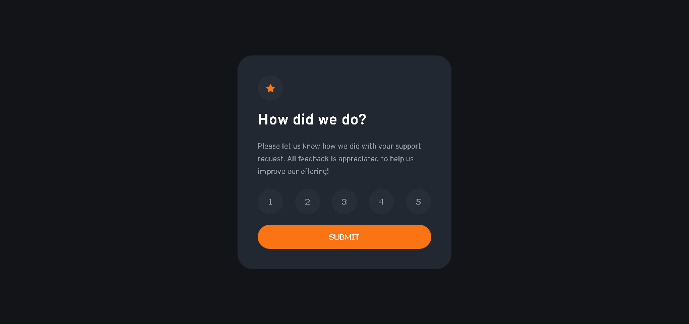

# Frontend Mentor - Interactive rating component solution
Product preview card component created using HTML &amp; CSS for frontendmentor.io .
This is a solution to the [Interactive rating component challenge on Frontend Mentor](https://www.frontendmentor.io/challenges/interactive-rating-component-koxpeBUmI).

## Table of contents
- [Overview](#overview)
  - [The challenge](#the-challenge)
  - [Screenshot](#screenshot)
  - [Links](#links)
- [My process](#my-process)
  - [Built with](#built-with)
  - [What I learned](#what-i-learned)
  - [Useful resources](#useful-resources)
- [Author](#author)

## Overview

### The challenge
Users should be able to:
- View the optimal layout for the app depending on their device's screen size
- See hover states for all interactive elements on the page
- Select and submit a number rating
- See the "Thank you" card state after submitting a rating

### Screenshot

### Links
- Link to the challenge's web site: [Interactive rating component solution](https://www.frontendmentor.io/challenges/interactive-rating-component-koxpeBUmI)
- Link to the solution or live site of the project: 

## My process 

### Built with 
- Semantic HTML5 markup.
- CSS custom properties
- Flexbox
- CSS Grid

### What I learned
- I learned a lot about HTML5 and CSS styles with grid and flexbox.

### Useful resources
- [MDN documentation](https://developer.mozilla.org/en-US/docs/Web/CSS).
- [Aprende HTML y CSS - Curso Desde Cero](https://www.youtube.com/watch?v=XqFR2lqBYPs)
- [CURSO CSS desde Cero - CSS BÁSICO Para PRINCIPIANTES](https://www.youtube.com/watch?v=N8V5JhasaSE).

## Author
- Linkedin profile: [Stiven Ojeda](https://www.linkedin.com/in/stiven-ojeda-090a3924a/)
